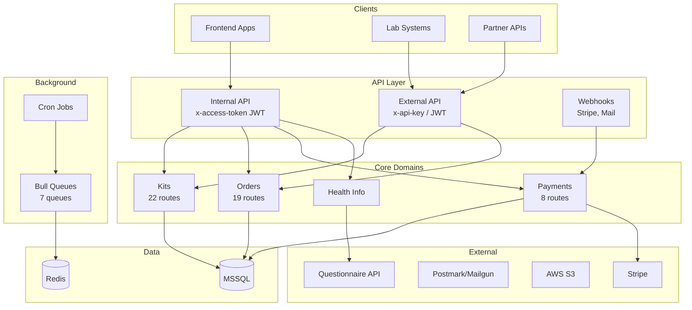

# Start Here - Vitract Kit API Onboarding

**Goal:** Get oriented in 10 minutes.

## What is This?

Vitract Kit API is the backend for the Vitract microbiome testing platform. It handles:

- **Test kit lifecycle** - ordering, registration, status tracking, lab integration
- **Replacement kits** - admin-initiated kit replacements with practitioner payment flow
- **Payments** - Stripe checkout, saved payment methods, monthly billing
- **Health information** - questionnaire sync with external API
- **User management** - customers, practitioners, admins with role-based access

## Architecture at a Glance



## Quick Reference

### Key Files to Know

| What | Where |
|------|-------|
| App entry point | [src/main.ts](../main.ts) |
| Global config | [src/config/keys.ts](../config/keys.ts) |
| All enums/status | [src/enum.ts](../enum.ts) |
| Queue job types | [src/queues/types/queue.types.ts](../queues/types/queue.types.ts) |
| Cron schedules | [src/cron/cron.service.ts](../cron/cron.service.ts) |
| Response helpers | [src/common/utils/response.ts](../common/utils/response.ts) |
| Exception filter | [src/common/filters/exceptions.filter.ts](../common/filters/exceptions.filter.ts) |

### Common Tasks

| I want to... | Go to... |
|--------------|----------|
| Add a new API route | Controller in relevant domain (`src/<domain>/<domain>.controller.ts`) |
| Add a background job | [src/queues/](../queues/) - add job type, processor, queue service method |
| Understand kit statuses | [src/enum.ts:19-27](../enum.ts) (KitStatus enum) |
| Debug a failing payment | [src/payment/services/stripe/](../payment/services/stripe/) |
| See all env vars | [src/config/keys.ts](../config/keys.ts) |
| Add a new migration | `yarn migration:generate:staging` then edit the file |

## Core Domains

### Kits (`src/kit/`)

Test kit management - registration, status updates, transfers.

- **Controller:** [kit.controller.ts](../kit/kit.controller.ts) - 22 routes
- **Key services:** `CreateKitService`, `UpdateKitStatusService`, `TransferKitService`
- **Status flow:** `ISSUED` → `REGISTERED` → `AWAITNG_SAMPLE` → `SAMPLE_RECIEVED` → `LAB_PROCESSING` → `RESULT_READY`
- **Lab integration:** `PUT /api/v1/kits/external/status/:kitId` (requires `x-api-key`)

### Orders (`src/order/`)

Kit ordering - pay-as-you-go, monthly billing, waitlist.

- **Controller:** [order.controller.ts](../order/order.controller.ts) - 19 routes
- **Key services:** `CreateOrderService`, `CreatePaygOrderService`, `CancelOrderService`
- **Order types:** `PayAsYouGo`, `MonthlyBilling`, `KitOnSite`
- **Status flow:** `pending` → `paid` → `shipped` (or `payment-failed`, `cancelled`)

### Payments (`src/payment/`)

Stripe integration - checkout, payment methods, webhooks.

- **Controller:** [payment.controller.ts](../payment/controllers/payment.controller.ts) - 8 routes
- **Webhook:** `POST /api/v1/payment/webhook` (validates `stripe-signature`)
- **Key events:** `checkout.session.completed`, `invoice.payment_succeeded`, `payment_intent.canceled`

### Billing (`src/billing/`)

Monthly billing cycle - no HTTP routes, runs via cron.

- **Scheduler:** [billing-scheduler.service.ts](../billing/services/billing-scheduler.service.ts)
- **Cron:** Every 2 hours on days 25-28 (configurable via `MONTHLY_BILLING_CRON`)
- **Logic:** Day N-1 = billing day, Days N to N+2 = retry window

### Health Info (`src/health-info/`)

Sync questionnaire completion status with external API.

- **Controller:** [health-info.controller.ts](../health-info/health-info.controller.ts)
- **SSE:** `GET /api/v1/sse/health-info/stream?kitId=<id>&userId=<id>`
- **Cron:** Every 5 minutes - sync + dispatch jobs

### Replacement Kits (`src/replacement-kit/`)

Admin-initiated kit replacements for practitioner orders.

- **Admin Controller:** [admin-replacement-kit.controller.ts](../admin/admin-replacement-kit.controller.ts) - 2 routes
- **Practitioner Controller:** [practitioner-replacement-kit.controller.ts](../practitioner/practitioner-replacement-kit.controller.ts) - 2 routes
- **Flow:** Admin creates request → Practitioner pays via Stripe → Webhook updates status → Fulfillment
- **Status flow:** `PENDING_PAYMENT` → `PAID` (or `CANCELLED`, `EXPIRED`)
- **See:** [Replacement Kits Domain](domains/replacement-kits.md) for full documentation

## Authentication

### Internal API (`x-access-token`)

JWT-based auth for frontend apps. Token contains user ID, email, role.

```typescript
// Middleware: VerifyTokenMiddleware
// Applied to: Most /api/v1/* routes
// Excluded routes are explicitly listed in each module
```

### External API (`x-api-key`)

API key auth for lab systems and partners.

```typescript
// Middleware: ApiKeyMiddleware
// Applied to: /api/v1/kits/external/*, /api/v1/external/*
// Keys stored in API_KEYS env var
```

### Roles

```typescript
enum AccountRoles {
  USER = 'user',
  CLIENT = 'client',
  PRACTITIONER = 'practitioner',
  ADMIN = 'admin',
  SUPER_ADMIN = 'super-admin',
}
```

Use `@UseGuards(RolesGuard)` + `@Roles(AccountRoles.ADMIN)` to protect routes.

## Response Format

All responses use a consistent envelope:

```typescript
// Success
{
  "status": "success",
  "message": "Kit was fetched successfully",
  "data": { ... },
  "count": 42  // optional, for paginated responses
}

// Error
{
  "status": "error",
  "message": "Kit not found",
  "data": ["validation error 1", "validation error 2"]  // for validation errors
}
```

## Background Jobs

### Queues (Bull/Redis)

| Queue | Job Types | Purpose |
|-------|-----------|---------|
| `stripe` | UPSERT_CHECKOUT_SESSIONS, PROCESS_PAYMENT_METHOD, SYNC_STRIPE_PRICES | Stripe sync |
| `billing` | RECONCILE_PROCESSING, PROCESS_INVOICE_PAYMENT | Monthly billing |
| `health` | HEALTH_INFO_SYNC, HEALTH_INFORMATION_DISPATCH | Questionnaire sync |
| `kit` | AUTO_REGISTER_PRACTITIONER_ORDER_KITS | Kit auto-registration |
| `mail` | SendMail, SendMailWithTemplate | Email sending |

### Cron Jobs

| Schedule | Purpose |
|----------|---------|
| Every hour | Reconcile processing statements |
| Every 2h (days 25-28) | Monthly billing cycle |
| Every 5 min | Health info sync + dispatch |

## Debugging Checklist

1. **API not responding?** Check `yarn start:dev` logs, Sentry
2. **Auth failing?** Verify token format, check middleware exclusions in module
3. **Queue job stuck?** Open Bull Board at `/v1/admin/queues`
4. **Payment webhook failing?** Check Stripe signature, verify `STRIPE_WEBHOOK_HASH`
5. **Migration failing?** Check MSSQL connection, run `yarn migration:run` manually

## Documentation Index

- [Entrypoints Reference](api/entrypoints-reference.md) - All routes, webhooks, cron, CLI
- [Queue Jobs Reference](platform/queue-jobs-reference.md) - Job types and data shapes
- [Environment Variables](platform/env-vars.md) - Full config reference
- [Error Catalog](operations/error-catalog.md) - Common errors and fixes
- [Auth Flows](architecture/auth-flows.md) - Diagrams for all auth mechanisms

### Domain Docs

- [Kits](domains/kits.md) | [Orders](domains/orders.md) | [Payments](domains/payments.md) | [Billing](domains/billing.md)
- [Health Info](domains/health-info.md) | [Support](domains/support.md) | [Vaari](domains/vaari.md)
- [Replacement Kits](domains/replacement-kits.md)

### Full Index

See [README.md](README.md) for complete documentation index.
