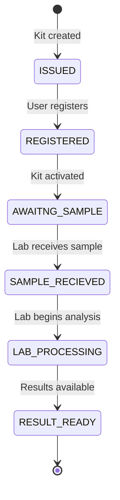
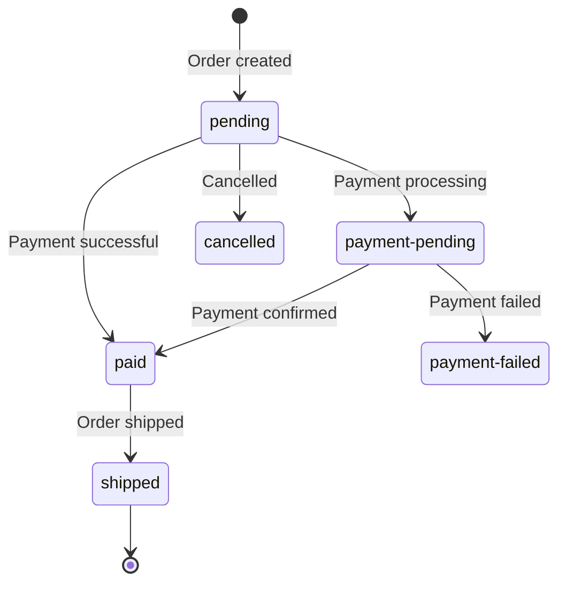
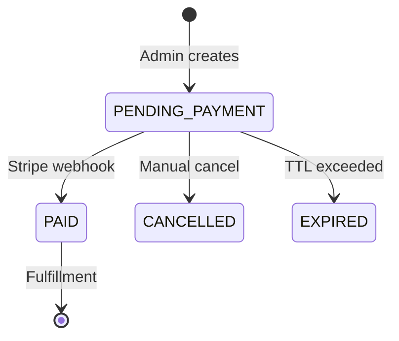
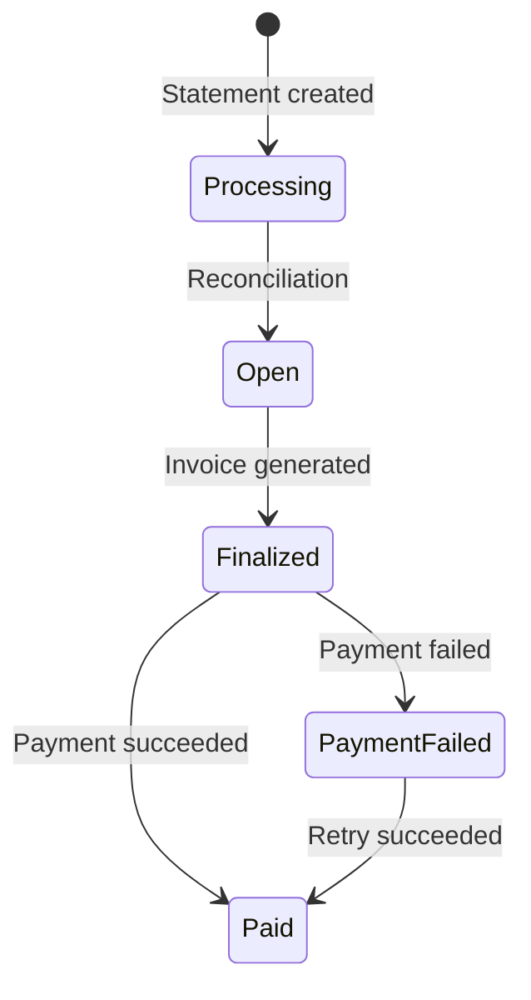

# Shared API Contracts

Common patterns, response formats, and conventions used across all API endpoints.

## Response Envelope

All API responses follow a consistent JSON envelope structure.

### Success Response

```typescript
interface SuccessResponse<T> {
  status: 'success';
  message: string;
  data: T;
  count?: number;  // For paginated responses
  code?: number;   // HTTP status code (optional)
}
```

**Example:**
```json
{
  "status": "success",
  "message": "Kits fetched successfully",
  "data": [
    { "id": "uuid-1", "status": "REGISTERED" },
    { "id": "uuid-2", "status": "AWAITING_SAMPLE" }
  ],
  "count": 42
}
```

### Error Response

```typescript
interface ErrorResponse {
  status: 'error';
  message: string;
  data?: string[] | object;  // Validation errors or additional context
  code?: number;
}
```

**Example (Validation Error):**
```json
{
  "status": "error",
  "message": "Validation failed",
  "data": [
    "email must be a valid email address",
    "quantity must be at least 1"
  ]
}
```

**Example (Not Found):**
```json
{
  "status": "error",
  "message": "Kit not found"
}
```

**Source:** [src/common/utils/response.ts](../../common/utils/response.ts)

---

## Authentication Headers

### JWT Authentication (`x-access-token`)

Used for authenticated internal API requests from frontend applications.

```http
GET /api/v1/kits/user-kits
x-access-token: eyJhbGciOiJIUzI1NiIsInR5cCI6IkpXVCJ9...
```

**Token Payload:**
```typescript
interface TokenPayload {
  id: string;          // User ID
  email: string;
  role: AccountRoles;  // 'user' | 'client' | 'practitioner' | 'admin' | 'super-admin'
  iat: number;
  exp: number;
}
```

**Middleware:** `VerifyTokenMiddleware`
**Config:** `ACCESS_KEY` (signing key), `ACCESS_TOKEN_MAX_AGE` (expiry)

### API Key Authentication (`x-api-key`)

Used for external integrations (lab systems, partners).

```http
PUT /api/v1/kits/external/status/kit-uuid
x-api-key: your-api-key-here
```

**Config:** `API_KEYS` (comma-separated list of valid keys)

### Stripe Webhook Signature (`stripe-signature`)

Used for Stripe webhook validation.

```http
POST /api/v1/payment/webhook
stripe-signature: t=1234567890,v1=abc123...
Content-Type: application/json
```

**Config:** `STRIPE_WEBHOOK_HASH` (webhook signing secret)

---

## Pagination

Paginated endpoints use query parameters and return `count` in the response.

### Request

| Parameter | Type | Default | Description |
|-----------|------|---------|-------------|
| `page` | number | 1 | Page number (1-indexed) |
| `limit` | number | 10 | Items per page (max varies by endpoint) |

**Example:**
```http
GET /api/v1/orders?page=2&limit=20
```

### Response

```json
{
  "status": "success",
  "message": "Orders fetched successfully",
  "data": [...],
  "count": 156
}
```

**Note:** `count` is the total number of items, not the page count. Calculate pages with `Math.ceil(count / limit)`.

---

## State Machines

### Kit Status



**Values:** `ISSUED`, `REGISTERED`, `AWAITNG_SAMPLE`, `SAMPLE_RECIEVED`, `LAB_PROCESSING`, `RESULT_READY`

**Source:** [src/enum.ts](../../enum.ts) - `KitStatus`

### Order Status



**Values:** `pending`, `paid`, `shipped`, `payment-pending`, `pending-invoice`, `partial-payment`, `payment-failed`, `cancelled`

**Source:** [src/enum.ts](../../enum.ts) - `OrderStatus`

### Replacement Kit Status



**Values:** `PENDING_PAYMENT`, `PAID`, `CANCELLED`, `EXPIRED`

**Source:** [src/enum.ts](../../enum.ts) - `ReplacementKitStatus`

### Payment Statement Status



**Values:** `Open`, `Finalized`, `Paid`, `Processing`, `PaymentFailed`

**Source:** [src/enum.ts](../../enum.ts) - `PaymentStatementStatus`

---

## Common Query Parameters

### Filtering

Many list endpoints support filtering by status:

```http
GET /api/v1/admin/replacement-kit-requests?status=PENDING_PAYMENT
GET /api/v1/orders?status=paid
```

### Sorting

Default sort order is `createdAt DESC` (newest first) unless otherwise specified.

---

## Error Codes

### HTTP Status Codes

| Code | Meaning | When Used |
|------|---------|-----------|
| 200 | OK | Successful GET, PUT, PATCH, DELETE |
| 201 | Created | Successful POST creating a resource |
| 400 | Bad Request | Validation error, invalid input |
| 401 | Unauthorized | Missing or invalid auth token |
| 403 | Forbidden | Valid auth but insufficient permissions |
| 404 | Not Found | Resource doesn't exist |
| 409 | Conflict | Duplicate resource (e.g., duplicate referenceId) |
| 429 | Too Many Requests | Rate limit exceeded |
| 500 | Internal Server Error | Unexpected server error |

### Custom Error Classes

| Class | HTTP Code | When Used |
|-------|-----------|-----------|
| `BadRequestErrorException` | 400 | Invalid request data |
| `NotFoundErrorException` | 404 | Resource not found |
| `ForbiddenErrorException` | 403 | Access denied |
| `ConflictErrorException` | 409 | Duplicate resource |

**Source:** [src/common/filters/](../../common/filters/)

---

## Rate Limiting

Protected by `ThrottlerGuard` on most endpoints:
- Default: 10 requests per 60 seconds per IP
- Configurable per-route

---

## CORS

Allowed origins configured via `origins` in [src/config/index.ts](../../config/index.ts).

**Headers:**
- `Access-Control-Allow-Credentials: true`
- `Access-Control-Allow-Origin: <allowed-origin>`

---

## Related Documentation

- [Entrypoints Reference](entrypoints-reference.md) - All API endpoints
- [Auth Flows](../architecture/auth-flows.md) - Authentication diagrams
- [Error Catalog](../operations/error-catalog.md) - Common errors and fixes
