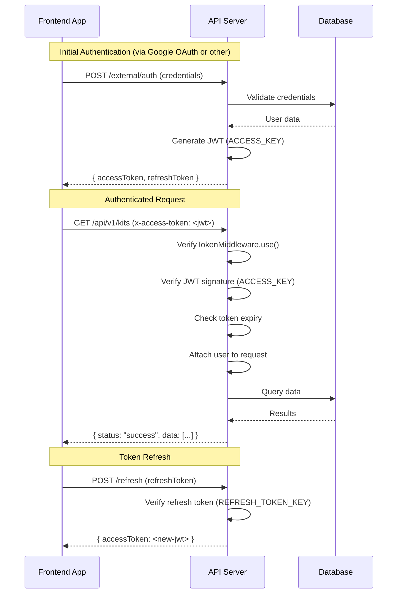
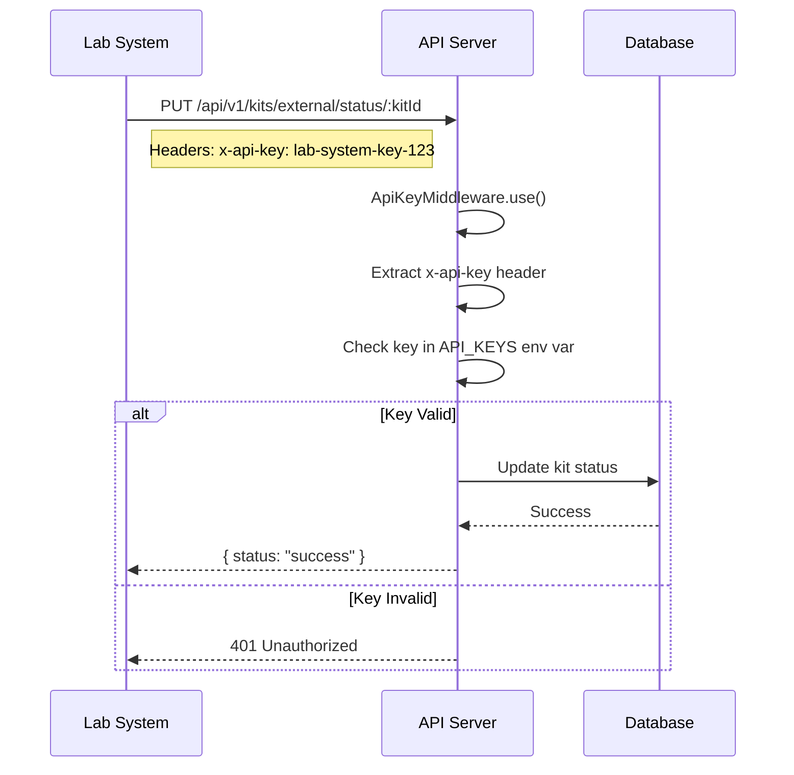
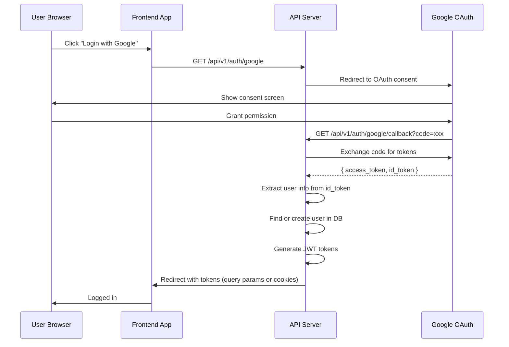
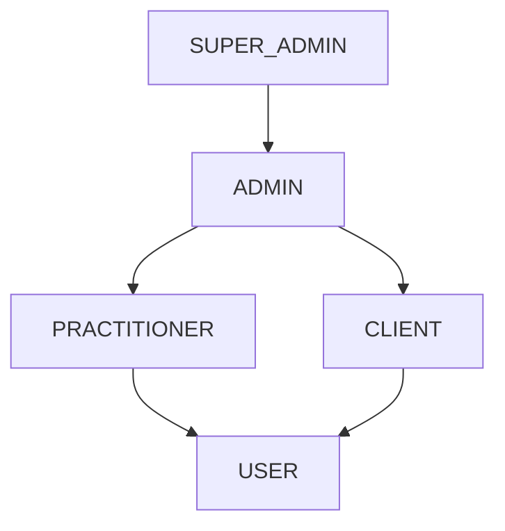
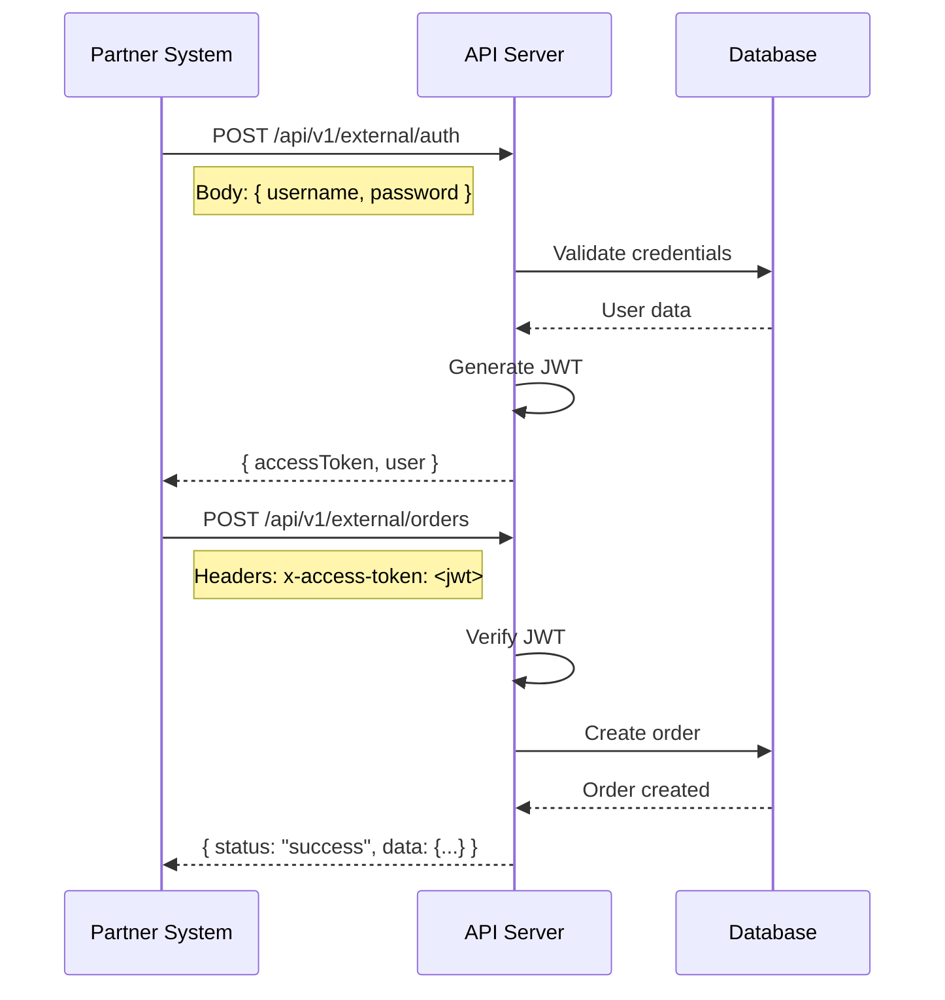
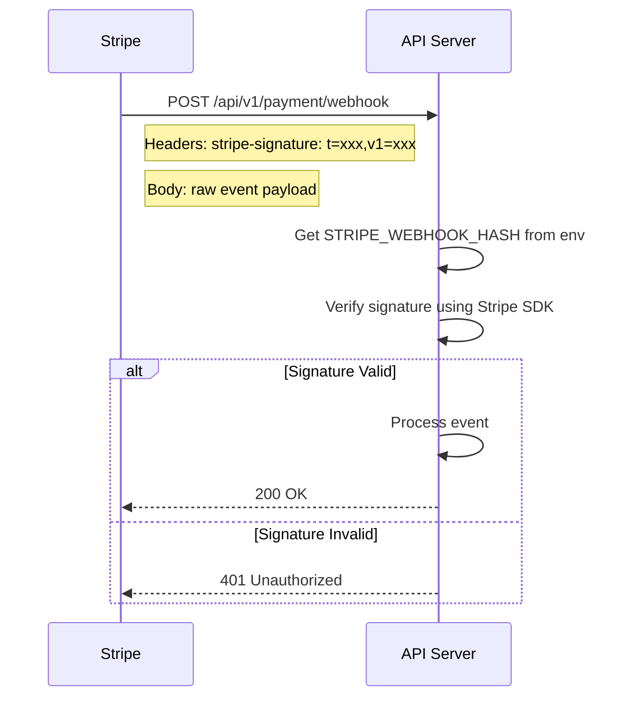

# Authentication Flows

Complete reference for all authentication mechanisms with Mermaid diagrams.

## Overview

The API supports three authentication mechanisms:

| Mechanism | Header | Use Case | Middleware |
|-----------|--------|----------|------------|
| JWT (Internal) | `x-access-token` | Frontend apps | `VerifyTokenMiddleware` |
| API Key | `x-api-key` | Lab systems, partners | `ApiKeyMiddleware` |
| Google OAuth | Browser redirect | Google login | `AuthGuard('google')` |

---

## JWT Authentication (Internal)

Used by frontend applications for authenticated API calls.

### Token Structure

```typescript
// Payload decoded from JWT
{
  id: string;           // User UUID
  email: string;
  firstName: string;
  lastName: string;
  role: AccountRoles;   // 'user' | 'client' | 'practitioner' | 'admin' | 'super-admin'
  practitionerId?: string;
}
```

### Token Flow



### Middleware Implementation

**Source:** [src/common/middleware/verify-token.middleware.ts](../../common/middleware/verify-token.middleware.ts)

```typescript
// Token verification flow
1. Extract token from x-access-token header
2. Verify signature using ACCESS_KEY
3. Check token expiry
4. Decode payload and attach to req.user
5. Continue to route handler
```

### Protected Routes

Most routes require `x-access-token`. Exclusions are explicitly listed in each module:

```typescript
// Example from kit.module.ts
consumer
  .apply(VerifyTokenMiddleware)
  .exclude(
    { path: 'kits/get-name/:kitId', method: RequestMethod.GET },
    { path: 'kits/singlekit/:id', method: RequestMethod.GET },
    // ...more exclusions
  )
  .forRoutes('kit*');
```

---

## API Key Authentication (External)

Used by lab systems and partner integrations.

### Key Format

API keys are stored in the `API_KEYS` environment variable as a comma-separated list:

```env
API_KEYS=lab-system-key-123,partner-api-key-456
```

### API Key Flow



### Middleware Implementation

**Source:** [src/common/middleware/api-key.middleware.ts](../../common/middleware/api-key.middleware.ts)

```typescript
// API key verification flow
1. Extract key from x-api-key header
2. Parse API_KEYS env var into array
3. Check if provided key is in array
4. If valid, continue; else 401 Unauthorized
```

### Protected Routes

API key routes are explicitly configured:

```typescript
// Example from kit.module.ts
consumer.apply(ApiKeyMiddleware).forRoutes({
  path: 'kits/external/status/:kitId',
  method: RequestMethod.PUT,
});
```

**Current API key protected routes:**
- `PUT /api/v1/kits/external/status/:kitId` - Lab kit status updates

---

## Google OAuth

Used for user authentication via Google.

### OAuth Flow



### Configuration

**Environment Variables:**
```env
GOOGLE_CLIENT_ID=xxx.apps.googleusercontent.com
GOOGLE_CLIENT_SECRET=xxx
GOOGLE_CALLBACK_URL=https://api.example.com/api/v1/auth/google/callback
```

### Controller

**Source:** [src/auth/auth.controller.ts](../../auth/auth.controller.ts)

```typescript
@Get('google')
@UseGuards(AuthGuard('google'))
async googleAuth(@Req() req) {}

@Get('google/callback')
@UseGuards(AuthGuard('google'))
async googleAuthRedirect(@Req() req, @Res() res) {
  await this.authService.googleAuth(req, res);
}
```

---

## Role-Based Access Control

### Roles

```typescript
enum AccountRoles {
  USER = 'user',
  CLIENT = 'client',
  PRACTITIONER = 'practitioner',
  ADMIN = 'admin',
  SUPER_ADMIN = 'super-admin',
}
```

### Role Hierarchy



### RolesGuard Usage

**Source:** [src/common/guards/roles.guard.ts](../../common/guards/roles.guard.ts)

```typescript
@UseGuards(RolesGuard)
@Roles(AccountRoles.ADMIN)
async adminOnlyRoute() {
  // Only admins and super-admins can access
}

@UseGuards(RolesGuard)
@Roles(AccountRoles.SUPER_ADMIN)
async superAdminOnlyRoute() {
  // Only super-admins can access
}
```

### Protected Admin Routes

| Route | Required Role |
|-------|---------------|
| `PUT /kits/practitioner-kit-name` | ADMIN |
| `POST /kits/transfer` | ADMIN |
| `PATCH /orders/:id/cancel` | ADMIN |
| `POST /admins/promote` | SUPER_ADMIN |
| `/vaari/customer-profiles/admin/*` | ADMIN |

---

## External Client Authentication

For partner systems that need JWT auth (not just API key).

### Flow



**Source:** [src/auth-external/auth-external.controller.ts](../../auth-external/auth-external.controller.ts)

---

## Webhook Authentication

### Stripe Webhook



**Verification:**
```typescript
// Stripe SDK handles verification
const event = stripe.webhooks.constructEvent(
  rawBody,
  signature,
  STRIPE_WEBHOOK_HASH
);
```

---

## Security Best Practices

### Token Storage (Frontend)
- Store access tokens in memory or secure HTTP-only cookies
- Never store in localStorage (XSS vulnerable)
- Refresh tokens should be HTTP-only cookies

### API Key Security
- Rotate keys periodically
- Use separate keys per integration
- Monitor key usage for anomalies

### JWT Best Practices
- Keep access token lifetime short (1 day)
- Use refresh tokens for longer sessions
- Sign with strong secrets (32+ chars)

---

## Debugging Auth Issues

### JWT Issues

```bash
# Decode JWT (without verification)
echo '<token>' | cut -d'.' -f2 | base64 -d

# Check expiry
# exp field is Unix timestamp
```

### Common Errors

| Error | Cause | Fix |
|-------|-------|-----|
| `401 Unauthorized` | Missing or invalid token | Check token format and validity |
| `403 Forbidden` | Insufficient role | User needs higher role |
| `Token expired` | Access token too old | Refresh the token |

See [Error Catalog](../operations/error-catalog.md#authentication-errors) for more details.
