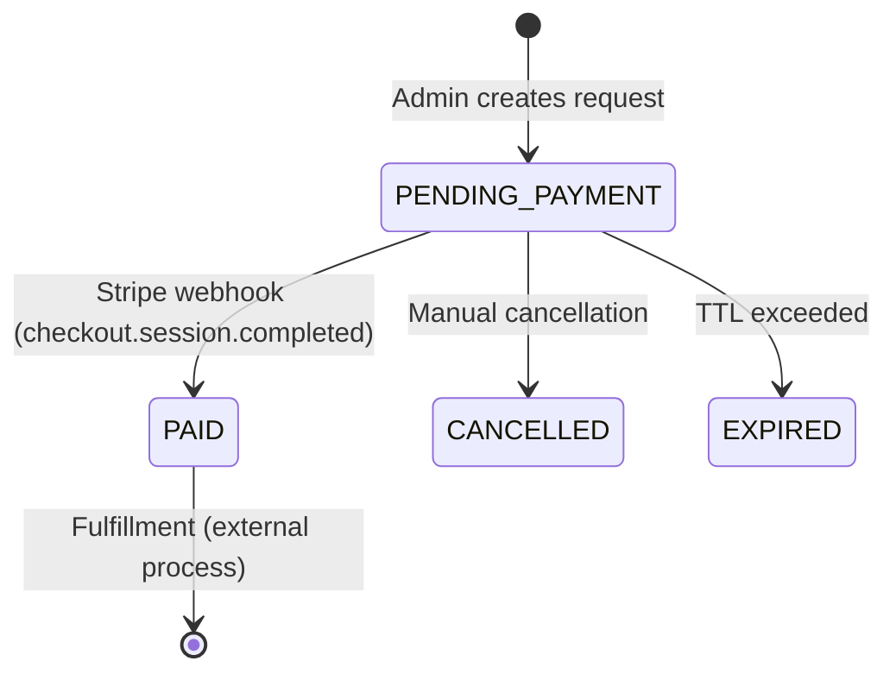

# Domain: Replacement Kits

Scope: Replacement kit request lifecycle - admin creation, practitioner payment, and fulfillment tracking.

## Source of truth

- **Controllers:**
  - `src/admin/admin-replacement-kit.controller.ts` - Admin endpoints
  - `src/practitioner/practitioner-replacement-kit.controller.ts` - Practitioner endpoints
- **Services:**
  - `src/replacement-kit/services/replacement-kit-request.service.ts` - Request creation
  - `src/replacement-kit/services/replacement-kit-checkout.service.ts` - Checkout flow
- **Entities:**
  - `src/replacement-kit/entity/kit-replacement-request.entity.ts`
- **Webhook Handler:**
  - `src/payment/services/stripe/checkout-session-completed.service.ts`

## Endpoint details (internal)

### Entrypoints

### Admin Endpoints

| Method | Route | Auth | Description |
| --- | --- | --- | --- |
| POST | `/admin/replacement-kit-requests` | `x-access-token` + ADMIN role | Create replacement kit request |
| GET | `/admin/replacement-kit-requests` | `x-access-token` + ADMIN role | List all requests (optional `?status=` filter) |

**Create Request Body:**
```json
{
  "targetType": "PRACTITIONER",
  "practitionerId": "uuid",
  "firstName": "Jane",
  "lastName": "Doe",
  "email": "jane@example.com",
  "kitType": "gut-scan",
  "currency": "USD",
  "quantity": 1,
  "address": {
    "country": "US",
    "addressLineOne": "123 Main St",
    "addressLineTwo": null,
    "city": "New York",
    "state": "NY",
    "postalCode": "10001"
  }
}
```

### Practitioner Endpoints

| Method | Route | Auth | Description |
| --- | --- | --- | --- |
| GET | `/practitioner/replacement-kit-requests` | `x-access-token` | List own replacement kit requests |
| POST | `/practitioner/replacement-kit-requests/:id/pay` | `x-access-token` | Generate Stripe checkout URL |

**Pay Endpoint Response:**
```json
{
  "status": "success",
  "message": "Checkout link generated",
  "data": {
    "url": "https://checkout.stripe.com/c/pay/...",
    "sessionId": "cs_live_..."
  }
}
```

## Endpoint details (external)

None documented.

## Schemas (DTOs)

### KitReplacementRequest Entity

| Field | Type | Description |
| --- | --- | --- |
| `id` | uuid | Primary key |
| `referenceId` | string | Unique reference (format: `repl_<uuid>`) |
| `targetType` | enum | `PRACTITIONER` or `CLIENT` |
| `practitionerId` | uuid | Practitioner ID (null for CLIENT type) |
| `firstName` | string | Recipient first name |
| `lastName` | string | Recipient last name |
| `email` | string | Recipient email |
| `kitType` | string | Kit type (gut-scan, deep-gut, etc.) |
| `currency` | string | USD or CAD |
| `quantity` | int | Number of kits |
| `country` | string | Country code (US, CA) |
| `addressLineOne` | string | Street address |
| `addressLineTwo` | string | Apt/Suite (optional) |
| `city` | string | City |
| `state` | string | State/Province |
| `postalCode` | string | Postal/ZIP code |
| `status` | enum | Current status |
| `paymentUrl` | string | Stripe checkout URL |
| `paymentSessionId` | string | Stripe session ID |
| `paymentDate` | datetime | When payment was completed |
| `createdByAdminId` | uuid | Admin who created the request |

### Status State Machine



**Status Values:**
- `PENDING_PAYMENT` - Awaiting practitioner/client payment
- `PAID` - Payment successful, ready for fulfillment
- `CANCELLED` - Manually cancelled
- `EXPIRED` - Payment link expired (not currently automated)

## Examples

See request/response samples in Endpoint details (internal).

### Side Effects

### On Request Creation (Admin)
1. Generate unique `referenceId` with `repl_` prefix
2. Create `KitReplacementRequest` with status `PENDING_PAYMENT`
3. No checkout URL generated (practitioner must initiate)

### On Checkout Link Generation (Practitioner)
1. Verify practitioner owns the request
2. Create Stripe checkout session via `CreateCheckoutSessionService`
3. Create associated `Order` with status `Pending`
4. Update `KitReplacementRequest.paymentUrl`
5. Return checkout URL to practitioner

### On Stripe Webhook (`checkout.session.completed`)
Detection: `metadata.paymentType = KIT_REPLACEMENT_ORDER` or `referenceId` starts with `repl_`

1. Update `KitReplacementRequest`:
   - `status` → `PAID`
   - `paymentSessionId` → session ID
   - `paymentDate` → current time
2. Update `Order`:
   - `status` → `Paid`
   - `completedAt` → current time
   - `amountSubtotal`, `amountTotal`, `amountTax`, `amountDiscount`
3. Update `Transaction`:
   - `status` → `Successful`

## Error cases

### Failure Modes

| Scenario | Symptom | Debug Steps |
| --- | --- | --- |
| Checkout URL not generated | 400 error on pay endpoint | Check request status is `PENDING_PAYMENT`; verify practitioner owns request |
| Payment not processed | Status stuck at `PENDING_PAYMENT` | Check Stripe dashboard for session; verify webhook delivery; check logs for `referenceId` |
| Order not created | Request paid but no order | Query orders by `referenceId`; check `checkout-session-completed.service.ts` logs |
| Webhook rejected | Stripe shows failed delivery | Verify `STRIPE_WEBHOOK_HASH`; check raw payload parsing |

### Common Errors

| Error | Cause | Fix |
| --- | --- | --- |
| "Replacement kit request not found" | Invalid ID | Verify UUID format |
| "You cannot access this replacement kit request" | Wrong practitioner | Practitioner can only pay for their own requests |
| "Checkout link is only available for pending payment requests" | Already paid or cancelled | Check current status |
| "practitionerId is required for practitioner targetType" | Missing field | Provide practitionerId for PRACTITIONER type |

## Related docs

- Entrypoints Reference: `src/docs/api/entrypoints-reference.md` - Full endpoint documentation
- Payments Domain: `src/docs/domains/payments.md` - Stripe integration details
- Webhook Side Effects: `src/docs/api/entrypoints-reference.md#stripe-webhook-side-effects` - All webhook handlers
- Orders Domain: `src/docs/domains/orders.md` - Order lifecycle
