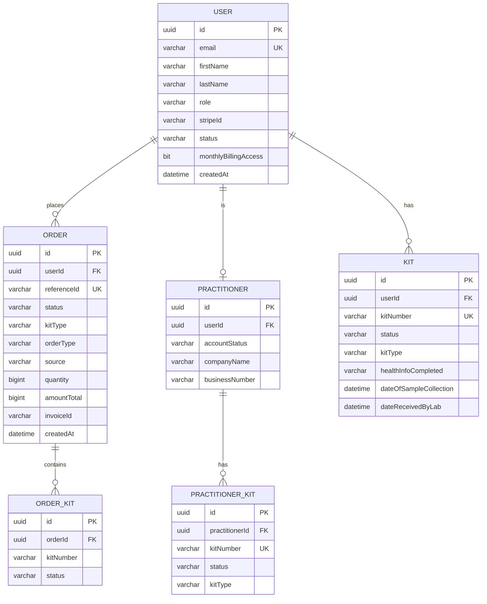
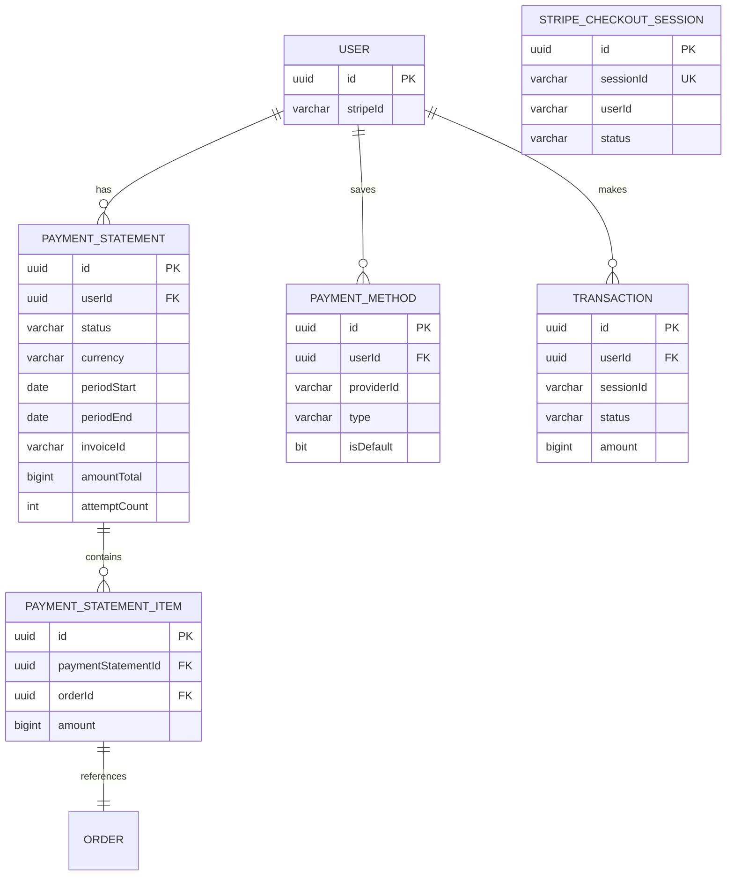
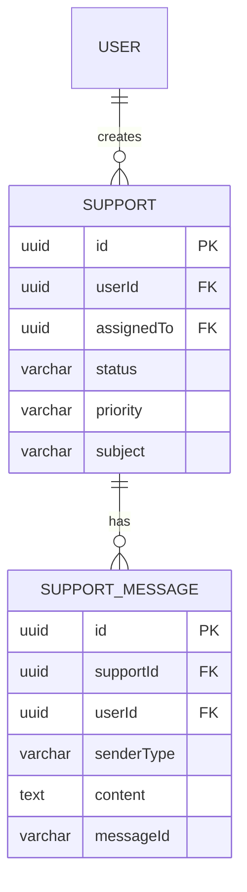

# Database Schema Reference

Overview of the MSSQL database schema with entity relationships.

**ORM:** TypeORM
**Database:** Microsoft SQL Server (MSSQL)

---

## Entity Relationship Diagram

### Core Entities



### Payment Entities



### Support Entities



---

## Entity Details

### User (`user` table)

Core user entity for all account types.

| Column | Type | Notes |
|--------|------|-------|
| `id` | uuid | Primary key |
| `email` | varchar | Unique |
| `firstName`, `lastName` | varchar | |
| `role` | varchar | `user`, `client`, `practitioner`, `admin`, `super-admin` |
| `strategy` | varchar | `normal`, `google` |
| `stripeId` | varchar | Stripe customer ID |
| `monthlyBillingAccess` | bit | Access to monthly billing |
| `status` | varchar | `active`, `archived` |
| `createdAt`, `updatedAt` | datetime | |

**Relations:**
- `1:N` → `Kit`, `Order`, `Transaction`, `PaymentMethod`, `PaymentStatement`
- `1:1` → `Practitioner`, `Admin`

**Source:** [src/user/entity/user.entity.ts](../../user/entity/user.entity.ts)

---

### Order (`orders` table)

Kit orders from practitioners and direct customers.

| Column | Type | Notes |
|--------|------|-------|
| `id` | uuid | Primary key |
| `userId` | uuid | FK to User (nullable) |
| `referenceId` | varchar | Unique order reference |
| `status` | varchar | See status enum below |
| `kitType` | varchar | `gut-scan`, `deep-gut`, `deep-gut-plus` |
| `orderType` | varchar | `pay_as_you_go`, `monthly-billing`, `kit_on_site` |
| `source` | varchar | `platform`, `website`, `waitlist`, `elyxium` |
| `quantity` | bigint | Number of kits |
| `amountTotal` | bigint | Total in cents |
| `currency` | varchar | `usd`, `cad` |
| `invoiceId` | varchar | Stripe invoice ID |
| `paymentUrl` | nvarchar(max) | Checkout URL |

**Order Status Flow:**
```
pending → paid → shipped
        ↘ payment-failed → cancelled
        ↘ payment-pending → paid
        ↘ pending-invoice → paid
```

**Source:** [src/order/entity/order.entity.ts](../../order/entity/order.entity.ts)

---

### Kit (`kit` table)

Registered kits owned by end users.

| Column | Type | Notes |
|--------|------|-------|
| `id` | uuid | Primary key |
| `userId` | uuid | FK to User |
| `kitNumber` | varchar | Unique kit barcode |
| `status` | varchar | See status enum below |
| `kitType` | varchar | `gut-scan`, `deep-gut`, `deep-gut-plus` |
| `healthInfoCompleted` | varchar | `yes`, `no` |
| `dateOfSampleCollection` | datetime | |
| `dateReceivedByLab` | datetime | |
| `resultsAvailable` | datetime | |
| `pdfUrl` | varchar | Report PDF URL |

**Kit Status Flow:**
```
Issued → registered → awaiting-sample → sample-received → lab-processing → result-ready
```

**Source:** [src/kit/entity/kit.entity.ts](../../kit/entity/kit.entity.ts)

---

### PractitionerKit (`practitioner_kits` table)

Kits assigned to practitioners (before end-user registration).

| Column | Type | Notes |
|--------|------|-------|
| `id` | uuid | Primary key |
| `practitionerId` | uuid | FK to Practitioner |
| `kitNumber` | varchar | Unique kit barcode |
| `status` | varchar | Same as Kit status |
| `orderId` | uuid | FK to Order |

**Source:** [src/kit/entity/practitioner-kits.entity.ts](../../kit/entity/practitioner-kits.entity.ts)

---

### PaymentStatement (`payment_statements` table)

Monthly billing statements for practitioners.

| Column | Type | Notes |
|--------|------|-------|
| `id` | uuid | Primary key |
| `userId` | uuid | FK to User |
| `status` | varchar | `open`, `finalized`, `processing`, `paid`, `payment_failed` |
| `currency` | varchar | `usd`, `cad` |
| `periodStart`, `periodEnd` | date | Billing period |
| `invoiceId` | varchar | Stripe invoice ID |
| `amountTotal` | bigint | Total in cents |
| `attemptCount` | int | Payment attempt count |
| `nextAttemptAt` | datetime | Next retry time |

**Statement Status Flow:**
```
open → finalized → processing → paid
                            ↘ payment_failed
```

**Source:** [src/payment/entity/payment-statement.entity.ts](../../payment/entity/payment-statement.entity.ts)

---

### Transaction (`transactions` table)

Payment transactions (Stripe checkout sessions).

| Column | Type | Notes |
|--------|------|-------|
| `id` | uuid | Primary key |
| `userId` | uuid | FK to User |
| `sessionId` | varchar | Stripe session ID |
| `status` | varchar | `pending`, `successful`, `failed` |
| `amount` | bigint | Amount in cents |
| `currency` | varchar | |

**Source:** [src/payment/entity/transaction.entity.ts](../../payment/entity/transaction.entity.ts)

---

## All Entities List

### Core Domain

| Entity | Table | Source |
|--------|-------|--------|
| User | `user` | [user.entity.ts](../../user/entity/user.entity.ts) |
| Admin | `admin` | [admin.entity.ts](../../admin/entity/admin.entity.ts) |
| Practitioner | `practitioner` | [practitioner.entity.ts](../../practitioner/entity/practitioner.entity.ts) |

### Kits

| Entity | Table | Source |
|--------|-------|--------|
| Kit | `kit` | [kit.entity.ts](../../kit/entity/kit.entity.ts) |
| PractitionerKit | `practitioner_kits` | [practitioner-kits.entity.ts](../../kit/entity/practitioner-kits.entity.ts) |
| FamilyKit | `family_kits` | [family-kit.entity.ts](../../kit/entity/family-kit.entity.ts) |
| ValidKit | `valid_kits` | [valid-kit.entity.ts](../../validKit/entity/valid-kit.entity.ts) |
| GeneratedKit | `generated_kits` | [genrated-kit.entity.ts](../../kit/entity/genrated-kit.entity.ts) |

### Orders

| Entity | Table | Source |
|--------|-------|--------|
| Order | `orders` | [order.entity.ts](../../order/entity/order.entity.ts) |
| OrderKit | `order_kits` | [order-kit.entity.ts](../../order/entity/order-kit.entity.ts) |
| Shipping | `shippings` | [shipping.entity.ts](../../order/entity/shipping.entity.ts) |
| ShotgunWaitlist | `shotgun_waitlists` | [shotgun-waitlist.entity.ts](../../order/entity/shotgun-waitlist.entity.ts) |

### Payments

| Entity | Table | Source |
|--------|-------|--------|
| Transaction | `transactions` | [transaction.entity.ts](../../payment/entity/transaction.entity.ts) |
| PaymentMethod | `payment_methods` | [payment-method.entity.ts](../../payment/entity/payment-method.entity.ts) |
| PaymentStatement | `payment_statements` | [payment-statement.entity.ts](../../payment/entity/payment-statement.entity.ts) |
| PaymentStatementItem | `payment_statement_items` | [payment-statement-item.entity.ts](../../payment/entity/payment-statement-item.entity.ts) |
| StripeCheckoutSession | `stripe_checkout_sessions` | [stripe-checkout-session.entity.ts](../../payment/entity/stripe-checkout-session.entity.ts) |
| StripePrice | `stripe_prices` | [stripe-price.entity.ts](../../payment/entity/stripe-price.entity.ts) |

### Support

| Entity | Table | Source |
|--------|-------|--------|
| Support | `supports` | [support.entity.ts](../../support/entity/support.entity.ts) |
| SupportMessage | `support_messages` | [support-message.entity.ts](../../support/entity/support-message.entity.ts) |

### Health Info

| Entity | Table | Source |
|--------|-------|--------|
| HealthInformationDispatchLog | `health_information_dispatch_logs` | [health-information-dispatch-log.entity.ts](../../health-info/entity/health-information-dispatch-log.entity.ts) |

### Other

| Entity | Table | Source |
|--------|-------|--------|
| CustomerProfile | `customer_profiles` | [customer-profile.entity.ts](../../vaari/entity/customer-profile.entity.ts) |
| ContactMessage | `contact_messages` | [contact-message.entity.ts](../../contact-message/entity/contact-message.entity.ts) |
| Feedback | `feedbacks` | [feedback.entity.ts](../../feedback/entity/feedback.entity.ts) |
| Tutorial | `tutorials` | [tutorial.entity.ts](../../tutorials/entity/tutorial.entity.ts) |
| Transfer | `transfers` | [transfer-log.entity.ts](../../user/entity/transfer-log.entity.ts) |

---

## Migrations

Migrations are in `src/common/migrations/` (production) and `src/common/migrations-staging/` (staging).

```bash
# Run migrations
yarn migration:run

# Generate new migration
yarn migration:generate:staging

# Revert last migration
yarn migration:revert
```

---

## Key Indexes

Performance-critical indexes are defined in entity files:

**PaymentStatement:**
- `IX_ps_status_periodEnd_userId_createdAt`
- `IX_ps_claimable` - For billing job queries
- `IX_ps_finalized_invoice_claimable`

**Kit:**
- `nci_msft_1_kit_...` - Composite index for common queries

See individual entity files for complete index definitions.
