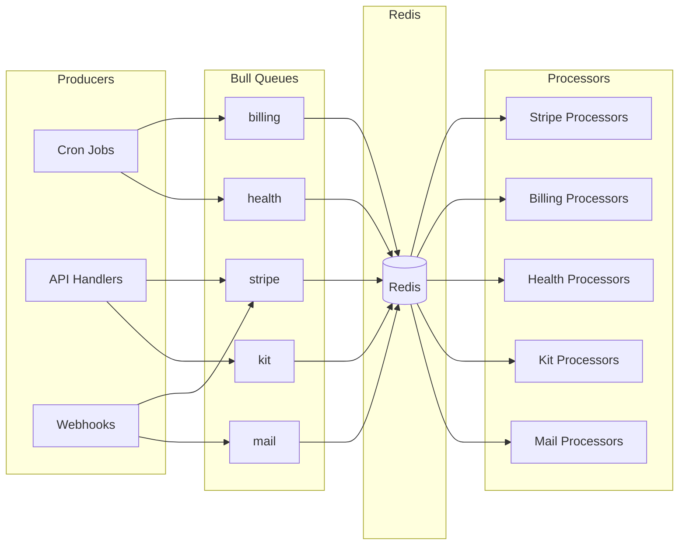

# Platform: Queues and Cron

Background job processing with Bull queues and scheduled tasks.

---

## Source of Truth

| Component | Location |
|-----------|----------|
| Cron scheduler | [src/cron/cron.service.ts](../../cron/cron.service.ts) |
| Queue module | [src/queues/queue.module.ts](../../queues/queue.module.ts) |
| Queue service | [src/queues/services/queue.service.ts](../../queues/services/queue.service.ts) |
| Queue types | [src/queues/types/queue.types.ts](../../queues/types/queue.types.ts) |
| Processors | [src/queues/processors/](../../queues/processors/) |
| Billing scheduler | [src/billing/services/billing-scheduler.service.ts](../../billing/services/billing-scheduler.service.ts) |

---

## Cron Jobs

### Schedule Overview

| Schedule | Method | Service | Purpose |
|----------|--------|---------|---------|
| Every hour | `handleEveryHourTasks` | `ScheduleService` | Enqueue reconcile processing job |
| `MONTHLY_BILLING_CRON` | `handleMonthlyBillingTasks` | `BillingSchedulerService` | Monthly billing cycle |
| Every 5 minutes | `handleHealthInfoSync` | `ScheduleService` | Enqueue health info sync job |
| Every 5 minutes | `handleHealthInformationDispatch` | `DispatchHealthInformationService` | Check pending dispatches |

### Cron Configuration

**Default schedules (can be overridden via env vars):**

| Env Var | Default | Description |
|---------|---------|-------------|
| `MONTHLY_BILLING_CRON` | `0 */2 25-28 * *` | Every 2 hours on days 25-28 |

### Billing Scheduler Logic

**Source:** [src/billing/services/billing-scheduler.service.ts](../../billing/services/billing-scheduler.service.ts)

```
Day = BILLING_PERIOD_START_DAY - 1 → Run monthly billing
Day >= BILLING_PERIOD_START_DAY and <= BILLING_PERIOD_START_DAY + 2 → Run payment retries
Otherwise → No action
```

With default `BILLING_PERIOD_START_DAY=26`:
- Day 25: Monthly billing runs
- Days 26-28: Payment retries run

---

## Queue System

### Architecture



### Queues

| Queue | Job Types | Purpose |
|-------|-----------|---------|
| `stripe` | UPSERT_CHECKOUT_SESSIONS, PROCESS_PAYMENT_METHOD, SYNC_STRIPE_PRICES | Stripe synchronization |
| `billing` | RECONCILE_PROCESSING, PROCESS_INVOICE_PAYMENT | Monthly billing |
| `health` | HEALTH_INFO_SYNC, HEALTH_INFORMATION_DISPATCH | Health questionnaire |
| `kit` | AUTO_REGISTER_PRACTITIONER_ORDER_KITS | Kit automation |
| `mail` | SendMail, SendMailWithTemplate | Email delivery |

### Default Job Options

```typescript
{
  removeOnComplete: 100,  // Keep last 100 completed
  removeOnFail: 200,      // Keep last 200 failed
  attempts: 3,            // Retry up to 3 times
  backoff: {
    type: 'exponential',
    delay: 2000           // 2s → 4s → 8s
  }
}
```

---

## Queue Admin

### Bull Board

Access at: `/v1/admin/queues` (basic auth required)

Features:
- View queue status (waiting, active, completed, failed)
- Inspect job data and logs
- Retry failed jobs
- Pause/resume queues
- Clean completed/failed jobs

### API Endpoints

```bash
# Get queue stats
GET /api/v1/queues/stats

# Pause all queues
POST /api/v1/queues/pause

# Resume all queues
POST /api/v1/queues/resume

# Trigger specific job
POST /api/v1/jobs/run/:jobType
```

---

## Processors

### Concurrency Settings

| Processor | Concurrency | Notes |
|-----------|-------------|-------|
| `StripeSyncPricesProcessor` | 2 | Stripe API rate limits |
| `ReconcileProcessingStatementsProcessor` | 2 | DB intensive |
| `HealthInfoSyncProcessor` | 1 | External API calls |
| `ProcessPaymentMethodProcessor` | 1 | Stripe API |
| `TestReportProcessor` | 2 | Testing |

### Processor Pattern

```typescript
@Processor(QueueNames.STRIPE)
@Injectable()
export class MyProcessor {
  private readonly logger = new Logger(MyProcessor.name);

  @Process({ name: JobTypes.MY_JOB, concurrency: 1 })
  async handle(job: Job<MyJobData>) {
    await job.log(`Processing ${job.id}`);
    // ... processing logic
    return { success: true };
  }

  @OnQueueActive()
  onActive(job: Job) {
    this.logger.log(`Job ${job.id} active`);
  }

  @OnQueueCompleted()
  onCompleted(job: Job, result: unknown) {
    this.logger.log(`Job ${job.id} completed`, { result });
  }

  @OnQueueFailed()
  onFailed(job: Job, err: Error) {
    this.logger.error(`Job ${job.id} failed`, { error: err.message });
  }
}
```

---

## Enqueuing Jobs

### Via Queue Service

```typescript
// src/queues/services/queue.service.ts
await this.queueService.addHealthInfoSyncJobDefault();
await this.queueService.addReconcileProcessingJob();
await this.queueService.addTestReportJob({ testId: '123', name: 'Test' });
```

### With Options

```typescript
await queue.add(
  JobTypes.MY_JOB,
  { data: 'value' },
  {
    attempts: 5,
    backoff: { type: 'fixed', delay: 10000 },
    delay: 5000,  // Start after 5s
    priority: 1,  // Higher priority
  }
);
```

---

## Required Environment Variables

| Variable | Required | Description |
|----------|----------|-------------|
| `REDIS_HOST` | Yes | Redis server host |
| `REDIS_PORT` | Yes | Redis server port |
| `REDIS_PASSWORD` | No | Redis auth password |
| `MONTHLY_BILLING_CRON` | No | Override billing schedule |
| `BILLING_PERIOD_START_DAY` | No | Billing day (default: 26) |

---

## Debugging

### Job Not Processing

1. Check Redis connection
2. Check Bull Board for queue status
3. Verify processor is registered in module
4. Check for job errors in Bull Board

### Job Failing

1. View error in Bull Board job details
2. Check `job.log()` output
3. Check processor logs
4. Verify job data shape matches processor expectations

### Queue Backlog

1. Check processor concurrency (too low?)
2. Check Redis memory
3. Check for slow DB queries in processor
4. Consider scaling workers

---

## Related Docs

- [Queue Jobs Reference](queue-jobs-reference.md) - Full job type documentation
- [Environment Variables](env-vars.md) - Redis and cron configuration
- [Error Catalog](../operations/error-catalog.md) - Queue error troubleshooting
